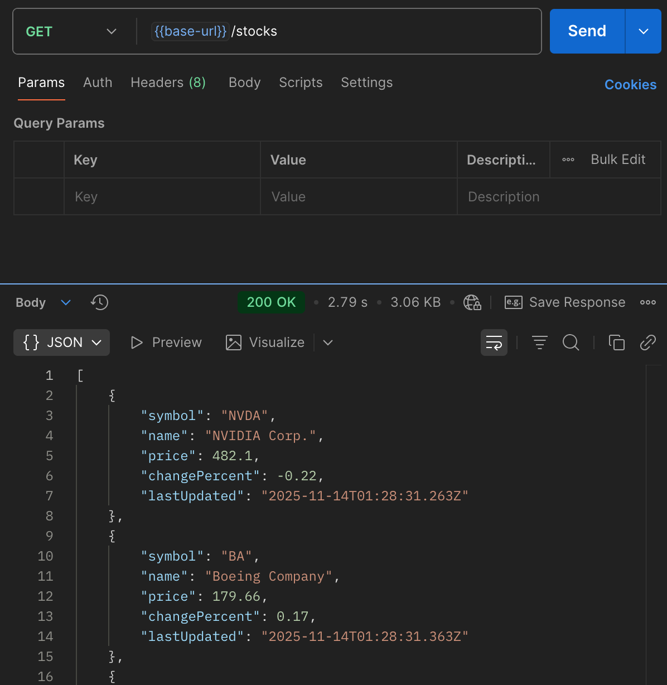
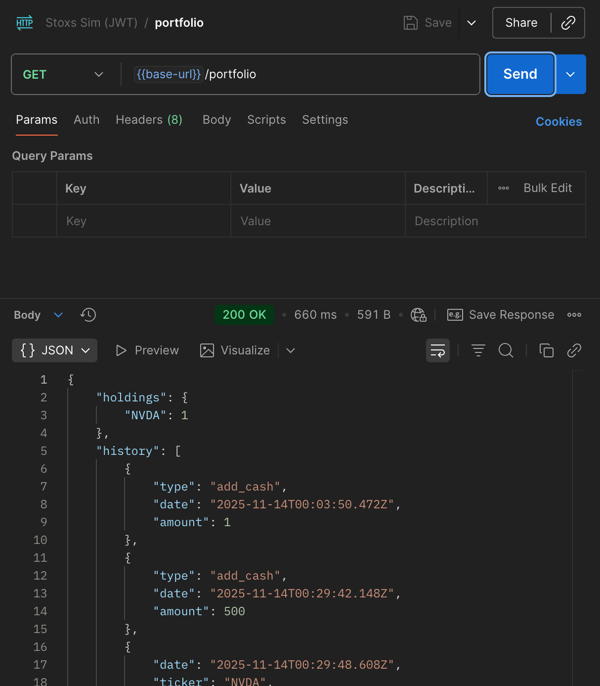
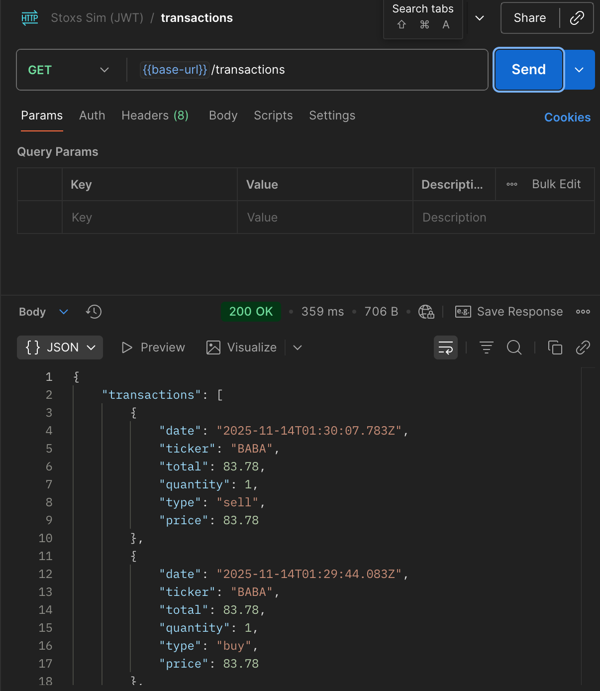
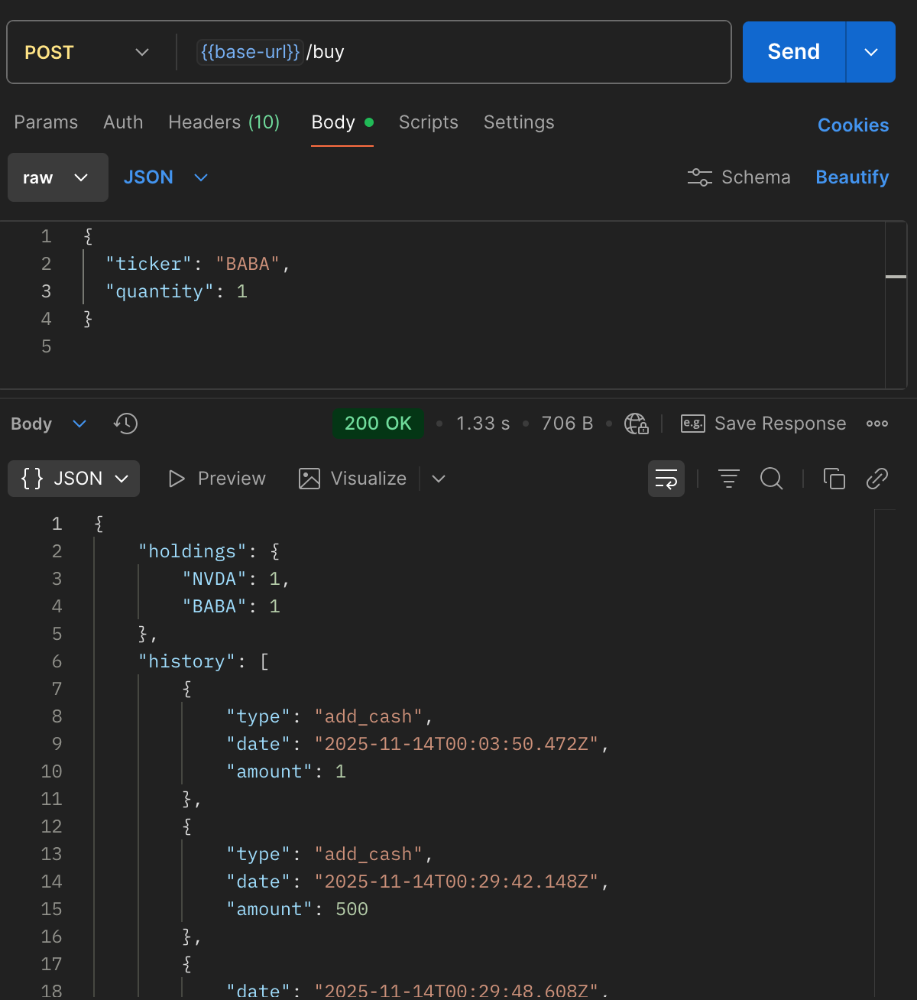
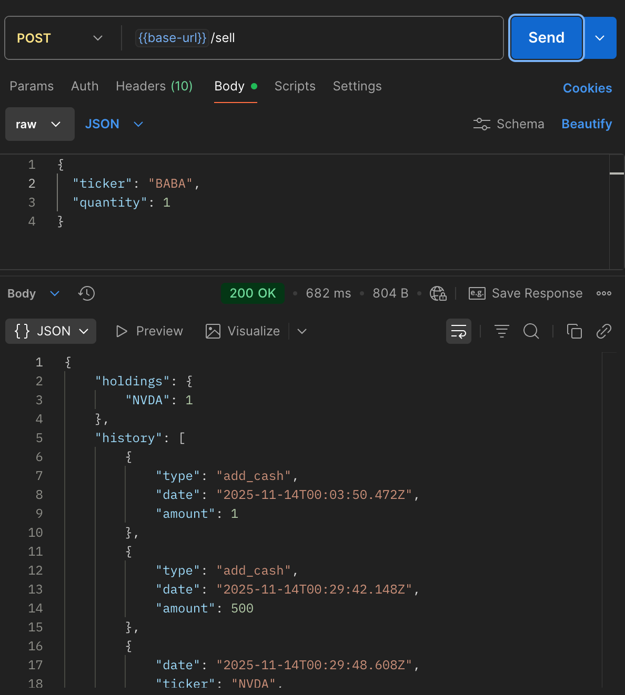
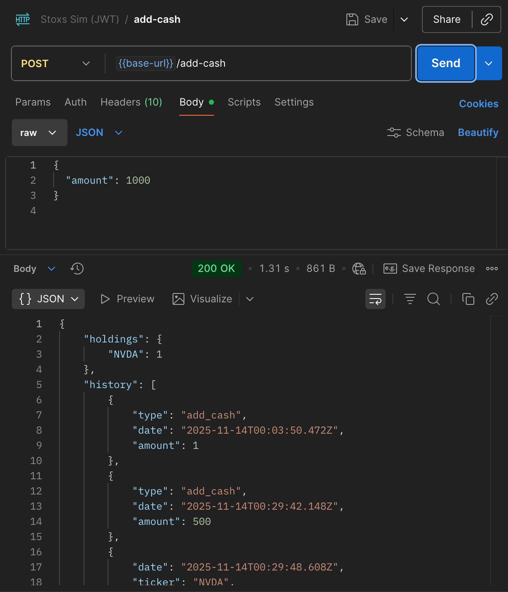

# Stox Simulator Api

A serverless backend that securely manages user portfolios, records trades, and updates stock and cash data.

[Frontend repository](https://github.com/katarina-andrews/stox-simulator-frontend)

## Author

- Katarina Andrews

## Database

The backend uses **two DynamoDB tables**:

1. **Stocks Table**

   - Stores **seed data** for available stocks.
   - Fields include:
     - `symbol` (Primary Key)
     - `name`
     - `price`
     - `changePercent`
     - `lastUpdated` 
     - `history` (price history)

2. **Portfolio Table**
   - Stores each user's portfolio and transaction history.
   - Fields include:
     - `userId` (Primary Key)
     - `cashBalance`
     - `history` (list of buy/sell/add cash actions)
     - `holdings` (list of stocks owned)

---

## API Routes

All routes are **protected with AWS Cognito JWT authentication**, **except `GET /stocks`**.  
To access protected routes, clients must include a valid **Cognito access token** in the request headers:  
`Authorization: Bearer <ACCESS_TOKEN>`

### GET /stocks

- Returns all current stock prices.
- **Public endpoint** (no JWT required).

### GET /portfolio

- Returns the authenticated user’s portfolio and cash balance.
- Requires JWT.

### GET /transactions

- Returns the user’s transaction history.
- Requires JWT.

### POST /buy

- Buy stock and add it to the user’s portfolio.
- Requires JWT.

### POST /sell

- Sell stock from the user’s holdings.
- Requires JWT.

### POST /add-cash

- Adds virtual cash to the user’s portfolio.
- Requires JWT.

